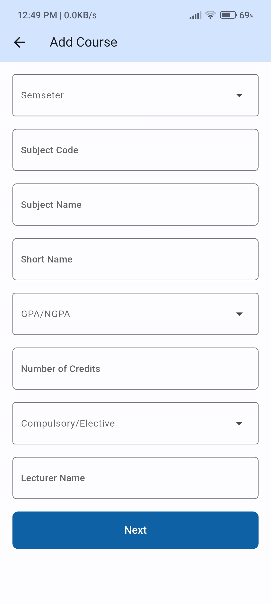

# Student Management System

Student Management System is a Flutter application designed to manage student information efficiently.
> This is NOT an official application, just a course work

## Features

- Add, update, and delete student & course details
- View student & course details
- Search for students & courses
- Integration with Firebase for backend services
- Maintain log for database changes

## Getting Started

### Prerequisites

- Flutter SDK: [Install Flutter](https://flutter.dev/docs/get-started/install)
- Dart SDK: Included with Flutter
- Android Studio or VS Code for Android development or Xcode for iOS development

### Installation

1. Clone the repository:
   ```sh
   git clone https://github.com/Ramith-Gunawardana/student_management_system.git
   cd student_management_system
   ```
2. Install dependencies:
  ```sh
   flutter pub get
   ```
3. Run the app:
  ```sh
   flutter run
   ```

## Screenshots

<p>
  
  
  
  
  
  
</p>

## Dependencies

- [`firebase_core`](https://pub.dev/packages/firebase_core)
- [`cloud_firestore`](https://pub.dev/packages/cloud_firestore)

## License

This project is licensed under the Apache License 2.0. See the [LICENSE](LICENSE) file for details.
